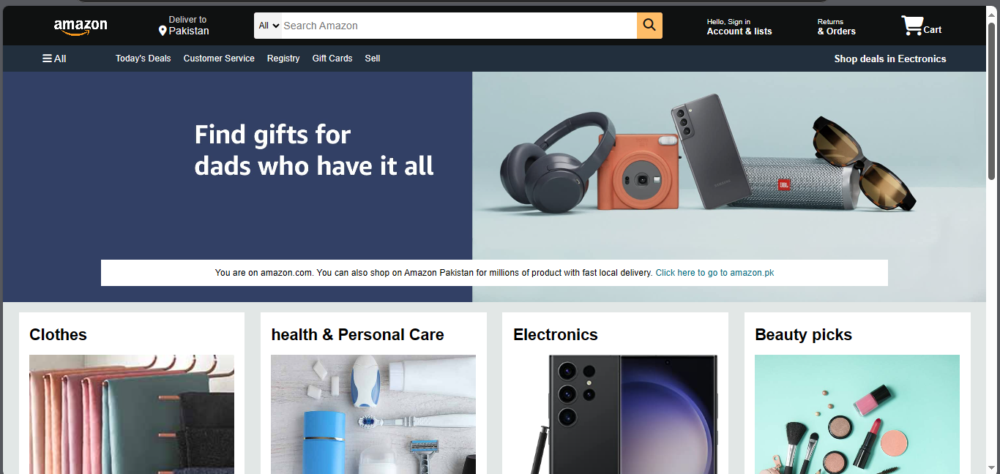
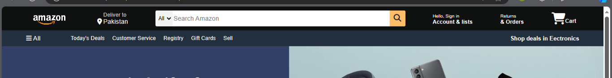
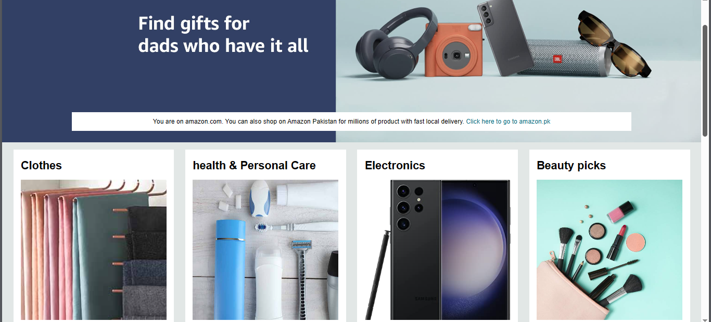
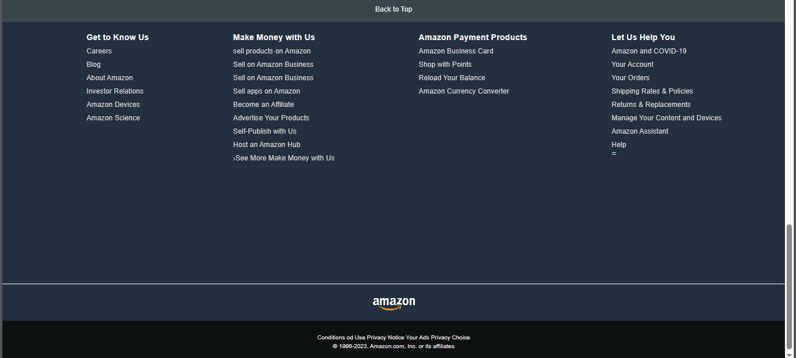

# Amazon Clone

This project is a simplified clone of the Amazon website, built with HTML, CSS, and Font Awesome icons. The focus of this project is on front-end design, responsive layout, and recreating an Amazon-inspired user interface.

## 🖥️ Demo

## 🌟 Features

- **Navigation Bar**: Amazon-style header with a logo, location box, search bar, sign-in section, returns, and a cart icon.
- **Responsive Panel**: Includes quick access links to Amazon services like Today's Deals, Customer Service, and more.
- **Product Sections**: Shop section with categorized product boxes such as Clothes, Electronics, Beauty Picks, and more.
- **Footer Links**: Comprehensive footer with links for users to navigate Amazon's services, customer support, and more.

## 🚀 Technologies Used

- **HTML5**: For the structure and layout.
- **CSS3**: For styling, layout, and responsive design.
- **Font Awesome**: For icons to enhance the UI (shopping cart, location, search, etc.).
- **Responsive Design**: Ensures the website adapts to various screen sizes and devices.

## 📸 Screenshots

> Add more screenshots here to showcase different sections of the project (navigation bar, product sections, footer, etc.).

- 
- 
- 

## 🤝 Contributing

Feel free to fork this repository, raise issues, or submit pull requests if you have ideas for improvement!
