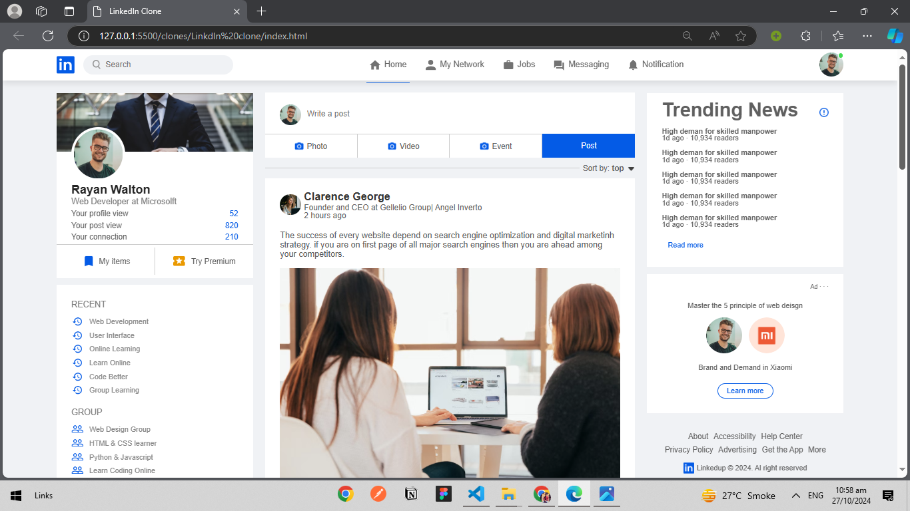
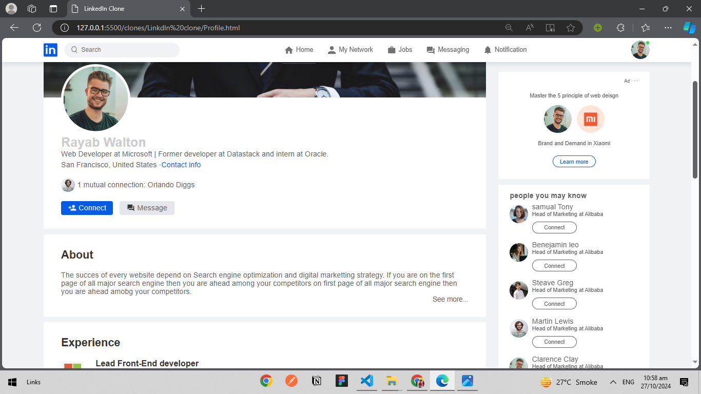

## Overview

This project is a clone of the LinkedIn user interface, showcasing various web development skills including HTML, CSS, and JavaScript. It features a profile page with user interactions, networking options, and a responsive design suitable for various devices.

 <!-- Replace with your actual screenshot path -->
 <!-- Replace with your actual screenshot path -->

## Features

- **Responsive Navigation Bar**: A fully functional navigation bar with links to different sections and a user icon that opens a profile menu.
- **User Profile**: Displays user information, including a profile picture, cover photo, experience, education, and skills.
- **Connection Requests**: Users can connect with others and send messages.
- **Dynamic Content**: User experience sections such as skills, languages, and education are dynamically rendered.
- **Ads and Suggestions**: A sidebar displaying advertisements and people you may know.

## Technologies Used

- **HTML**: Structure of the web pages.
- **CSS**: Styling the web pages for a visually appealing layout.
- **JavaScript**: Adding interactivity to the user interface.

## Installation

1. Clone the repository:
   ```bash
   git clone https://github.com/yourusername/linkedin-clone.git
   ```

## Usage

1. Navigate to the project directory:
   ```bash
   cd linkedin-clone
   ```
2. Open `index.html` in your web browser to view the project.

### Features

- Open `index.html` in your browser to view the homepage.
- Click on user icons to toggle the profile menu.
- Navigate through the different sections using the navigation bar.

## Project Structure

```
linkedin-clone/
├── index.html         # Homepage of the application
├── profile.html       # User profile page
├── style.css          # CSS styles for the project
├── script.js          # JavaScript for interactivity
├── images/            # Folder containing images used in the project
└── screenshots/        # Folder for screenshots of the project
```

## Contributing

Feel free to contribute by forking the repository and submitting a pull request. Any improvements, bug fixes, or feature enhancements are welcome. Please ensure that your contributions adhere to the following guidelines:

1. Fork the repository.
2. Create a new branch for your feature or bug fix.
3. Commit your changes and push to your branch.
4. Submit a pull request detailing your changes.

## License

This project is open-source and available under the MIT License. You can freely use, modify, and distribute this project, but please provide attribution to the original creator.

## Acknowledgments

- Special thanks to [Font Awesome](https://fontawesome.com/) for providing icons used in this project.
- Inspiration from the original LinkedIn design and user experience.

## Contact

For any questions or feedback, please contact:

- **Name**: Hasnain Arif
- **Email**: [hasnainarif571@gmail.com] <!-- Replace with your actual email address -->
- **GitHub**: [Nainee99](https://github.com/Nainee99) <!-- Replace with your actual GitHub profile link -->

```

```
