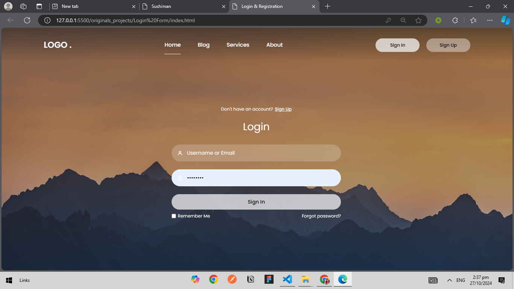

Here's a `README.md` specifically for your "Login & Registration" project:

---

# Login & Registration Form 🚀

**Project Description:**  
This project is a **Login & Registration form** built with HTML and CSS, featuring an interactive design and animations for smooth transitions between login and registration states. The layout includes a navigation bar, form fields with icons, and toggle functionality to switch between forms.



---

## 🌟 Features

- **Responsive Navigation Bar:**  
  Includes a responsive nav bar with links to Home, Blog, Services, and About sections.

- **Interactive Login & Register Forms:**  
  Both forms have icons in the input fields, and buttons to toggle between the forms.

- **Checkboxes & Links:**  
  Options like "Remember Me," "Forgot password?" and "Terms & Conditions" add additional functionality.

## 🚀 How to Use

1. **Clone the Repository:**
   ```bash
   git clone https://github.com/Nainee99/frontend-foundations.git
   ```
2. **Navigate to the Project Folder:**
   ```bash
   cd frontend-foundations/original_projects/login_registration
   ```
3. **Open the HTML File:**  
   Launch `index.html` in your browser to view the form interface.

---

## 📂 Project Structure

```
login_registration/
├── index.html
├── style.css
└── images/
    └── login_registration.png
```

---

## ✨ Preview

View the live layout and interactivity by opening the HTML file or previewing the screenshot.
