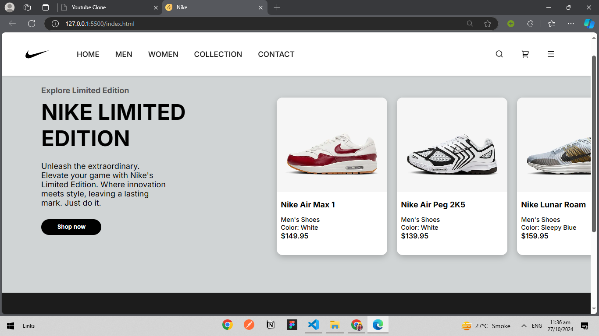

# Nike Limited Edition Website

## Overview

This project is a responsive website for Nike's limited edition collection. The website showcases various Nike shoes, their details, and features a sleek, modern design.

## Features

- **Responsive Design**: The website adjusts to various screen sizes, providing a seamless experience on mobile and desktop devices.
- **Navigation Bar**: A user-friendly navigation bar with hover effects and quick access to different sections.
- **Product Showcase**: Displays multiple Nike products with images, names, colors, and prices in USD.
- **Footer**: An attractive footer section with quick links, social media icons, and additional information about Nike.

## Technologies Used

- **HTML**: For the structure of the web pages.
- **CSS**: For styling and layout, including flexbox for responsive design.
- **Fonts**: Custom fonts sourced from Google Fonts for a modern look.
- **Icons**: Remix Icon library for visually appealing icons in the navigation and footer.

## Installation

1. Clone the repository:
   ```bash
   git clone https://github.com/Nainee99/nike-limited-edition-website.git
   ```
2. Navigate to the project directory:
   ```bash
   cd nike-limited-edition-website
   ```
3. Open the `index.html` file in your web browser to view the project.

## Screenshots



## Contributing

Feel free to submit issues or create pull requests for any enhancements or fixes. Contributions are welcome!

## License

This project is open-source and available under the [MIT License](LICENSE).

## Acknowledgments

- Inspired by Nike's innovative designs and marketing.
- Thanks to the open-source community for providing resources and tools that made this project possible.

```

```
