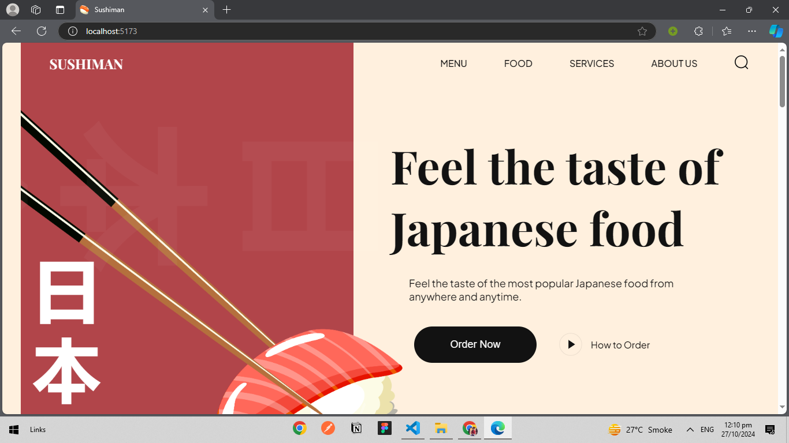

Here’s an updated version of the `README.md` file that includes a section for the screenshot:

````markdown
# Sushiman

Welcome to **Sushiman**, a sushi-themed website designed to showcase the best of Japanese cuisine. This project features an elegant and responsive design, highlighting popular Japanese dishes and providing an engaging user experience.

## Table of Contents

- [Features](#features)
- [Technologies Used](#technologies-used)
- [Installation](#installation)
- [Usage](#usage)
- [Screenshot](#screenshot)
- [Contributing](#contributing)
- [License](#license)

## Features

- **Responsive Design**: The website is optimized for both desktop and mobile devices.
- **Interactive Navigation**: Smooth navigation links to various sections of the site.
- **Hero Section**: A captivating hero section that showcases Japanese food.
- **Menu Display**: An interactive menu displaying popular dishes with ratings and prices.
- **About Us Section**: Information about the mission and values of Sushiman.
- **Testimonials**: Customer reviews highlighting satisfaction.

## Technologies Used

- HTML5
- CSS3
- JavaScript (for interactivity and animations)
- [AOS (Animate On Scroll)](https://michalsnik.github.io/aos/) for scroll animations

## Installation

1. Clone the repository:
   ```bash
   git clone https://github.com/yourusername/sushiman.git
   ```
````

2. Navigate to the project directory:
   ```bash
   cd sushiman
   ```
3. Open the `index.html` file in your preferred web browser.

## Usage

You can explore the website by navigating through the menu items. The "Order Now" and "How to Order" buttons in the hero section provide user interaction. Explore the different food items in the menu and learn more about Sushiman in the About Us section.

## Screenshot



## Contributing

Contributions are welcome! If you'd like to contribute, please fork the repository and submit a pull request. Here are some ways you can help:

- Improve the design with new CSS styles.
- Add more food items to the menu.
- Enhance the user experience with JavaScript interactivity.

## License

This project is licensed under the MIT License. See the [LICENSE](LICENSE) file for details.

---

Enjoy exploring the flavors of Japan with Sushiman!

```

### Notes:
- Make sure to place the `demo.png` screenshot in the `screenshots` folder as indicated.
- You can adjust the screenshot path if necessary based on your folder structure.
- Feel free to modify any section further to match your project's specifics!
```
