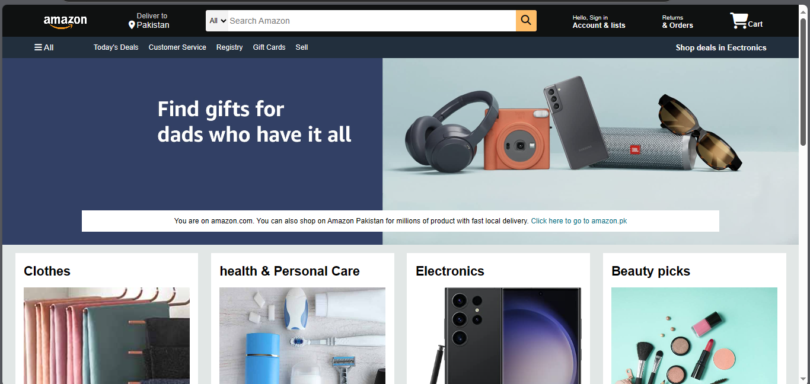
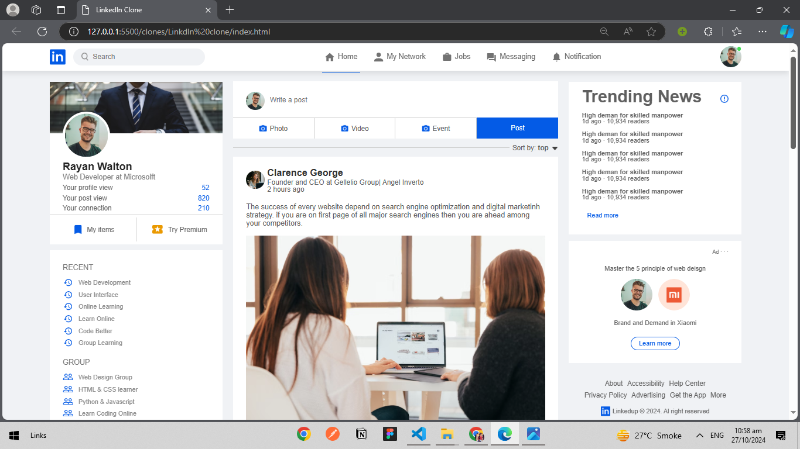
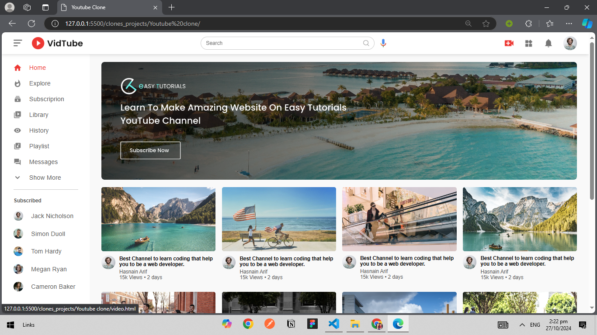
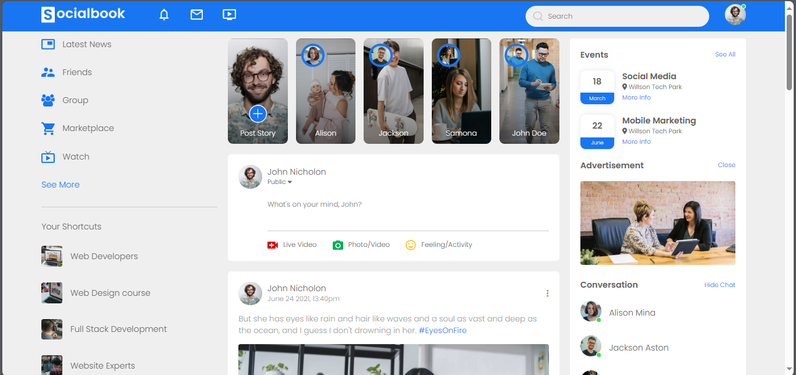
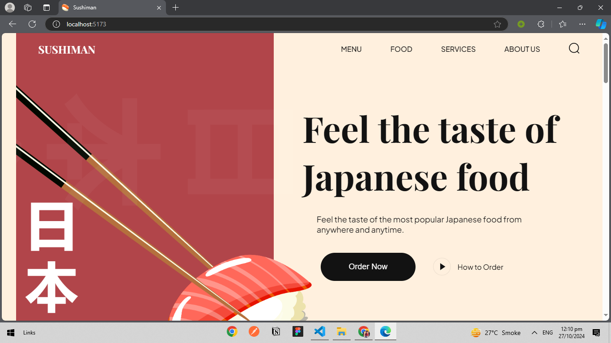
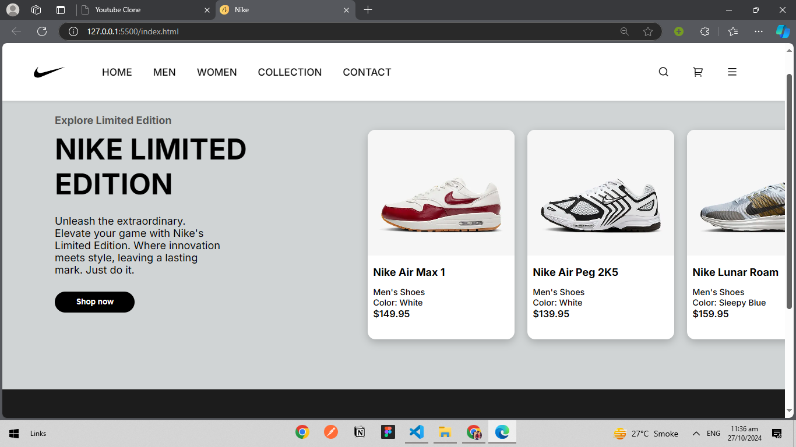

# Frontend Foundations 🌐✨

_A collection of HTML & CSS projects - a blend of popular clones and original designs!_

  

> **A journey into frontend design!** This repository includes my efforts in creating clones of popular websites and original projects that demonstrate my skills in HTML and CSS. From a sleek CV showcase to unique landing pages, this collection covers a broad range of styles and layouts.

---

## 🔥 Projects Overview

### 📁 Folder Structure

```
frontend-foundations/
├── clone_projects/        # Contains clones of popular websites
│   ├── amazon-clone/
│   ├── facebook-clone/
│   ├── youtube-clone/
│   └── linkedin-clone/
│
├── original_projects/     # Contains original, unique project designs
│   ├── cv-showcase/
│   ├── sushiman-website/
│   └── nike-landing-page/
│
└── screenshots/           # Screenshots for preview
    ├── amazon.png
    ├── facebook.png
    ├── youtube.png
    ├── linkedin.png
    ├── sushiman.png
    └── nike.png
```

### 📌 Clone Projects

Here are previews of each clone project:

- **Amazon Clone** 🛒  
  A clean, responsive layout capturing the essence of Amazon’s homepage.  
  

- **Facebook Clone** 🌐  
  Emulating the structure of Facebook's landing page with attention to detail.  
  

- **YouTube Clone** 🎥  
  A streamlined version of YouTube’s UI with video thumbnail previews.  
  

- **LinkedIn Clone** 💼  
  A professional network interface inspired by LinkedIn.  
  

---

### 🌟 Original Projects

Unique designs and personal projects that showcase my HTML and CSS creativity:

- **Sushiman Website** 🍣  
  A culinary delight of a website, themed around sushi to give users a tasty experience.  
  

- **Nike Limited Edition Landing Page** 👟  
  A dynamic landing page for a limited-edition Nike product, with captivating visuals.  
  

---

## 🚀 Getting Started

To explore each project locally:

1. Clone this repository:
   ```bash
   git clone https://github.com/yourusername/frontend-foundations.git
   ```
2. Open the project folder in your preferred code editor (like VS Code).
3. Open each project’s HTML file in your browser to see the designs.

---

## 📸 Screenshots

Each project includes a `screenshots` folder for quick previews, as displayed above.

---

## 🛠 Technologies Used

- **HTML5** - Markup structure
- **CSS3** - Styling and responsive design
- **VS Code** - Primary code editor
- **Git & GitHub** - Version control and project hosting

---

## 🌱 Future Enhancements

- **Responsive Design** - Improve mobile compatibility for all projects.
- **Animations & Effects** - Add CSS animations for a more interactive experience.
- **JavaScript Features** - Add basic JavaScript for dynamic functionality.

---

## 🖊️ Author

**Your Name**  
💼 [Hasnain Arif](https://linkedin.com/in/www.linkedin.com/in/hasnain-arif-452229239)  
📧 hasnainarif571@gmail.com

---
